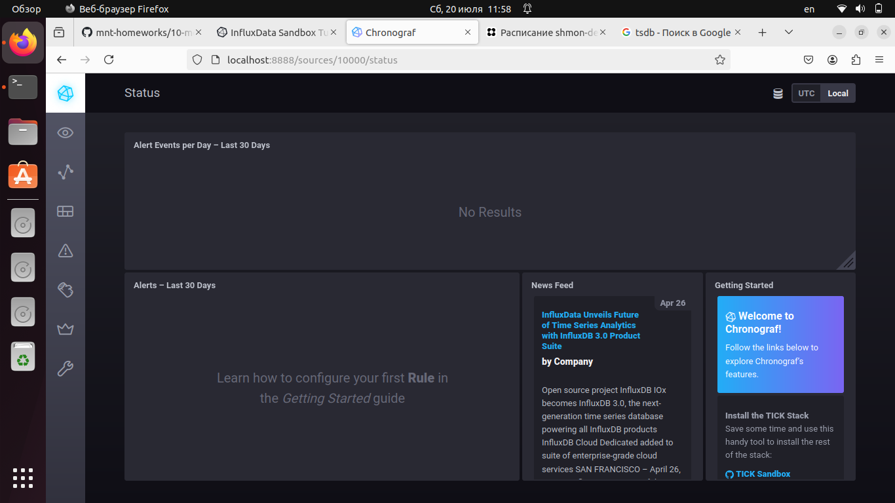
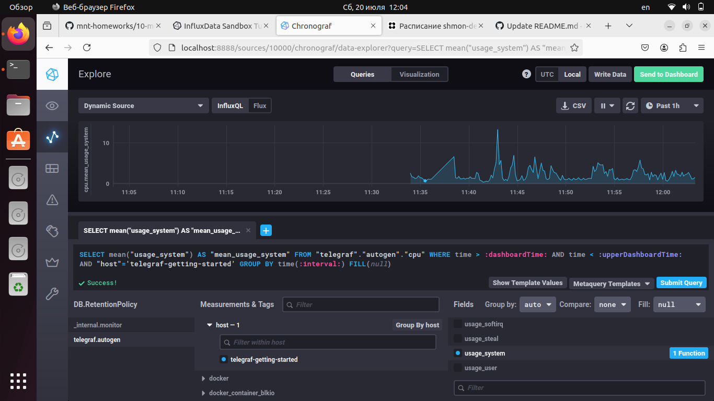
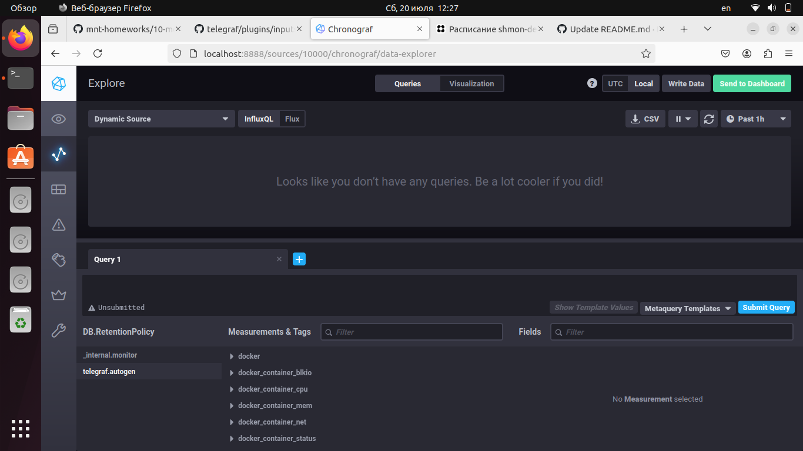
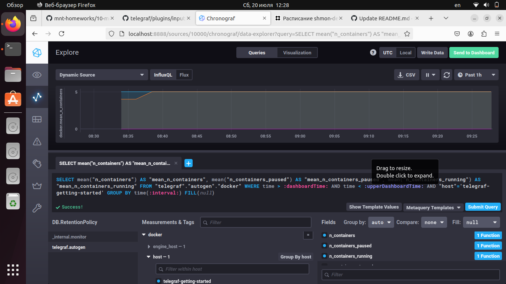

# Домашнее задание к занятию "13.Системы мониторинга"

## Обязательные задания

1. Вас пригласили настроить мониторинг на проект. На онбординге вам рассказали, что проект представляет из себя 
платформу для вычислений с выдачей текстовых отчетов, которые сохраняются на диск. Взаимодействие с платформой 
осуществляется по протоколу http. Также вам отметили, что вычисления загружают ЦПУ. Какой минимальный набор метрик вы
выведите в мониторинг и почему?

#### Ответ:

Для контроля работы по протоколу HTTP:

- Время отклика/среднее временя ответа - позволяет понять скорость обработки запросов и реагировать при увеличении времени отклика
- Величина трафика/количества запросов к серверу - позволяет видеть количество клиентов и понимать время пиковой и минимальной загруженности системы
- Уровень ошибок - видим и реагируем на ошибки
- Степень загруженности - позволяет оценить наши ресурсы в данный момент и спрогнозировать необходимость изменений в будующем

Для контроля работы системы/железа:

- CPUla - контролируем нагрузку - необходимо для работы с вычислениями
- RAM - контролируем свободное количество - необходимо для работы с вычислениями
- Inodes - контролируем количество (если конечны для файловой системы) - необходимы для отчетов
- FS - контролируем место - необходимо для сохранения отчетов

#
2. Менеджер продукта посмотрев на ваши метрики сказал, что ему непонятно что такое RAM/inodes/CPUla. Также он сказал, 
что хочет понимать, насколько мы выполняем свои обязанности перед клиентами и какое качество обслуживания. Что вы 
можете ему предложить?

#### Ответ:

- RAM - информация о состоянии оперативной памяти 
- inodes - информация о индексных дескрипторах , их переполнение делает невозможным создание новых файлов.
- CPUla - информация о нагрузке на центральный процессор

Для оценки уровня качества обслуживания используют следующие показатели : SLO, SLA, SLI.

#
3. Вашей DevOps команде в этом году не выделили финансирование на построение системы сбора логов. Разработчики в свою 
очередь хотят видеть все ошибки, которые выдают их приложения. Какое решение вы можете предпринять в этой ситуации, 
чтобы разработчики получали ошибки приложения?

#### Ответ:

В данном случае можно использовать open-source проект Sentry.

#
4. Вы, как опытный SRE, сделали мониторинг, куда вывели отображения выполнения SLA=99% по http кодам ответов. 
Вычисляете этот параметр по следующей формуле: summ_2xx_requests/summ_all_requests. Данный параметр не поднимается выше 
70%, но при этом в вашей системе нет кодов ответа 5xx и 4xx. Где у вас ошибка?

#### Ответ:

Опытный SRE запамятовал , что параметр нужно вычислять по формуле : SLI = (summ_2xx_requests + summ_3xx_requests) / (summ_all_requests)

#
5. Опишите основные плюсы и минусы pull и push систем мониторинга.

#### Ответ:

Pull модель:

плюсы:
- легче контролировать подлинность данных
- можно настроить единый proxy server до всех агентов с TLS
- упрощённая отладка получения данных с агентов

минусы:
- сложность настройки для корректной передачи данных , например, в случае с NAT придется прокидовать порт
- нужно обеспечивать дополнительную безопасность системы мониторинга - установка реверс-прокси, настройка файрволла 

Push модель:

плюсы:
- упрощение репликации данных в разные системы мониторинга или их резервные копии
- более гибкая настройка отправки пакетов данных с метриками
- UDP — это менее затратный способ передачи данных, из-за чего может возрасти производительность сбора метрик

минусы:
- обнаружение доступности агента - сразу непонять причину: упал агент ,сервер или неполадки с сетью  
- необходимо позаботиться о том, как доставить авторизационные ключи и настройки подключения в конфиги агентов

#
6. Какие из ниже перечисленных систем относятся к push модели, а какие к pull? А может есть гибридные?

    - Prometheus 
    - TICK
    - Zabbix
    - VictoriaMetrics
    - Nagios

#### Ответ:

Push модель:      VictoriaMetrics, TICK

Pull модель:      Nagios, Prometheus

Гибридная модель: Zabbix

#
7. Склонируйте себе [репозиторий](https://github.com/influxdata/sandbox/tree/master) и запустите TICK-стэк, 
используя технологии docker и docker-compose.

В виде решения на это упражнение приведите скриншот веб-интерфейса ПО chronograf (`http://localhost:8888`). 

P.S.: если при запуске некоторые контейнеры будут падать с ошибкой - проставьте им режим `Z`, например
`./data:/var/lib:Z`

#### Ответ:



#
8. Перейдите в веб-интерфейс Chronograf (http://localhost:8888) и откройте вкладку Data explorer.
        
    - Нажмите на кнопку Add a query
    - Изучите вывод интерфейса и выберите БД telegraf.autogen
    - В `measurments` выберите cpu->host->telegraf-getting-started, а в `fields` выберите usage_system. Внизу появится график утилизации cpu.
    - Вверху вы можете увидеть запрос, аналогичный SQL-синтаксису. Поэкспериментируйте с запросом, попробуйте изменить группировку и интервал наблюдений.

Для выполнения задания приведите скриншот с отображением метрик утилизации cpu из веб-интерфейса.

#### Ответ:




#
9. Изучите список [telegraf inputs](https://github.com/influxdata/telegraf/tree/master/plugins/inputs). 
Добавьте в конфигурацию telegraf следующий плагин - [docker](https://github.com/influxdata/telegraf/tree/master/plugins/inputs/docker):
```
[[inputs.docker]]
  endpoint = "unix:///var/run/docker.sock"
```

Дополнительно вам может потребоваться донастройка контейнера telegraf в `docker-compose.yml` дополнительного volume и 
режима privileged:
```
  telegraf:
    image: telegraf:1.4.0
    privileged: true
    volumes:
      - ./etc/telegraf.conf:/etc/telegraf/telegraf.conf:Z
      - /var/run/docker.sock:/var/run/docker.sock:Z
    links:
      - influxdb
    ports:
      - "8092:8092/udp"
      - "8094:8094"
      - "8125:8125/udp"
```

После настройке перезапустите telegraf, обновите веб интерфейс и приведите скриншотом список `measurments` в 
веб-интерфейсе базы telegraf.autogen . Там должны появиться метрики, связанные с docker.

Факультативно можете изучить какие метрики собирает telegraf после выполнения данного задания.

#### Ответ:




---

