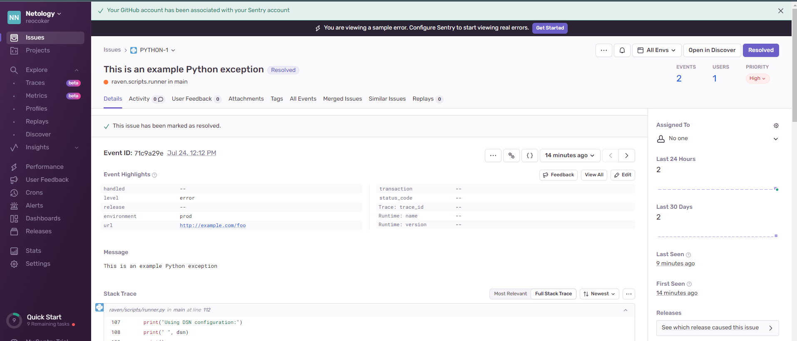

# Домашнее задание к занятию 16 «Платформа мониторинга Sentry»

## Задание 1

Так как Self-Hosted Sentry довольно требовательная к ресурсам система, мы будем использовать Free Сloud account.

Free Cloud account имеет ограничения:

- 5 000 errors;
- 10 000 transactions;
- 1 GB attachments.

Для подключения Free Cloud account:

- зайдите на sentry.io;
- нажмите «Try for free»;
- используйте авторизацию через ваш GitHub-аккаунт;
- далее следуйте инструкциям.

В качестве решения задания пришлите скриншот меню Projects.

### Решение


## Задание 2

1. Создайте python-проект и нажмите `Generate sample event` для генерации тестового события.
1. Изучите информацию, представленную в событии.
1. Перейдите в список событий проекта, выберите созданное вами и нажмите `Resolved`.
1. В качестве решения задание предоставьте скриншот `Stack trace` из этого события и список событий проекта после нажатия `Resolved`.

### Решение




## Задание 3

1. Перейдите в создание правил алёртинга.
2. Выберите проект и создайте дефолтное правило алёртинга без настройки полей.
3. Снова сгенерируйте событие `Generate sample event`.
Если всё было выполнено правильно — через некоторое время вам на почту, привязанную к GitHub-аккаунту, придёт оповещение о произошедшем событии.
4. Если сообщение не пришло — проверьте настройки аккаунта Sentry (например, привязанную почту), что у вас не было 
`sample issue` до того, как вы его сгенерировали, и то, что правило алёртинга выставлено по дефолту (во всех полях all).
Также проверьте проект, в котором вы создаёте событие — возможно алёрт привязан к другому.
5. В качестве решения задания пришлите скриншот тела сообщения из оповещения на почте.
6. Дополнительно поэкспериментируйте с правилами алёртинга. Выбирайте разные условия отправки и создавайте sample events. 

### Решение


## Задание повышенной сложности

1. Создайте проект на ЯП Python или GO (около 10–20 строк), подключите к нему sentry SDK и отправьте несколько тестовых событий.
2. Поэкспериментируйте с различными передаваемыми параметрами, но помните об ограничениях Free учётной записи Cloud Sentry.
3. В качестве решения задания пришлите скриншот меню issues вашего проекта и пример кода подключения sentry sdk/отсылки событий.

### Решение

Создадим проект на python на проверку установленных(импортированных модулей) модулей:

```
import argparse
import importlib
import os
import pkgutil
import sentry_sdk
from sentry_sdk import capture_exception

# find on https://docs.sentry.io/error-reporting/quickstart/?platform=python
sentry_sdk.init(dsn=os.getenv('SENTRY_DSN'))


def import_submodules(package):
    """Import all submodules of a module, recursively, including subpackages.

    :param package: package (name or actual module)
    :type package: str | module
    :rtype: dict[str, types.ModuleType]
    """
    if isinstance(package, str):
        package = importlib.import_module(package)
    results = {}
    for loader, name, is_pkg in pkgutil.walk_packages(package.__path__):
        full_name = package.__name__ + '.' + name
        try:
            results[full_name] = importlib.import_module(full_name)
            if is_pkg:
                results.update(import_submodules(full_name))
        except ModuleNotFoundError as mnfe:
            print("module not found: {}".format(full_name))
            capture_exception(mnfe)
        except Exception as general_exception:
            print(general_exception)
            capture_exception(general_exception)
    return results


if __name__ == "__main__":
    parser = argparse.ArgumentParser()
    parser.add_argument("package")
    args = parser.parse_args()

    package_to_load = args.package
    results = import_submodules(package_to_load)
    for r in results:
        print(str(r))

```

Проверим importlib, который импортирован, и неустановленный flask


Идем на sentry.io: 


Проверяем почту:


